# Reverse Engineering the AM335x Boot ROM

It's probably been eighteen months since I first got my hands a few Beaglebone Black boards, saved from the dumpster. Unfortunately, the boards didn't work right away. Now, this was my first time working with one of these boards, or any single board computer for that matter, so I wasn't sure if the problem was something I was doing, or something wrong with the boards themselves (perhaps why they were headed for the dumpster in the first place). It has taken me quite a long time, and a large amount of effort, to get these boards to actually start booting, but damn it, I did it. And here's what I learned along the way.

#### NOTE: How to Use the Ghidra XML File
I've included some utilities in this repo, along with an xml file exported from Ghidra which has all the symbols I've obtained so far from reversing. I used [this post](https://github.com/NationalSecurityAgency/ghidra/discussions/3853#discussioncomment-1976557) to export without the actual firmware, to avoid any copyright issues, just in case. If you want to debug the boot ROM yourself, you'll already have the JTAG hooked up, so you can dump the boot ROM (from `0x20000` to `0x2BFFF`) yourself.

To load the symbols:

1. Create a new Ghidra project. Import the *binary* (not the XML) into Ghidra: Use ARMv7 Little Endian, and make sure under Options you set the base address to `0x20000` and you can set the block name to `bootrom`. 
2. Open this binary in CodeBrowser. *DO NOT ANALYZE*. 
3. Go to File > Add program, and select the XML file. Defaults should be fine. You can now go through the reset handler, or jump to `main()`, or the MMC/SD card boot handler.


## The Problem

To begin with, I knew these were custom versions of the standard beaglebone black, so early on I determined that it could be something missing on the board itself, like a board identifier. What I saw when booting a standard SD card formatted with balenaEtcher, was just nothing. I expected the LEDs on the board to start blinking, and I expected that connecting up a UART to USB cable would allow me to see the U-Boot process. However, the UART was quiet. If I removed the SD card, it would output the letter `C` over and over, which is expected behavior for a UART/serial boot. It was definitely *trying* to boot, and the SD card was altering this behavior, but I didn't have any more visibility. Most troubleshooting on the web took the U-Boot output as a starting point to diagnose problems. I guess I wasn't going to have that luxury.

I figured at this point that it would be worthwhile to connect up a debug probe. Unfortunately, I didn't have a matching header for the existing footprint come so I made my own.

The beaglebone board has a header with designator P2 which breaks out the JTAG connections. I connected some wires to this up to a female header so that I can talk to it through my J-Link.

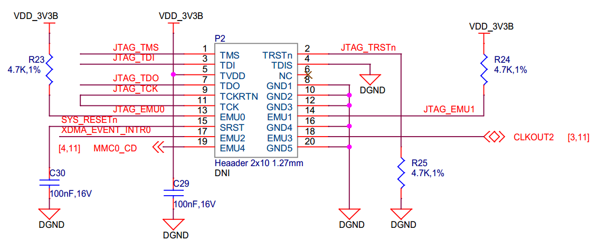
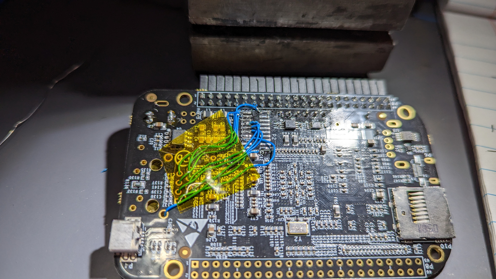
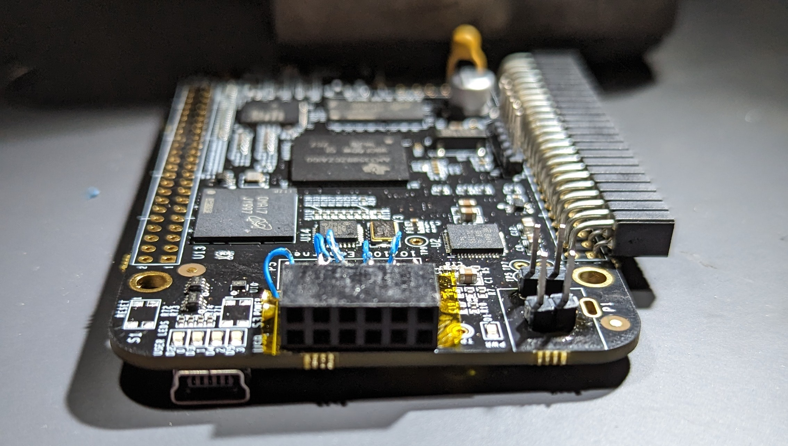

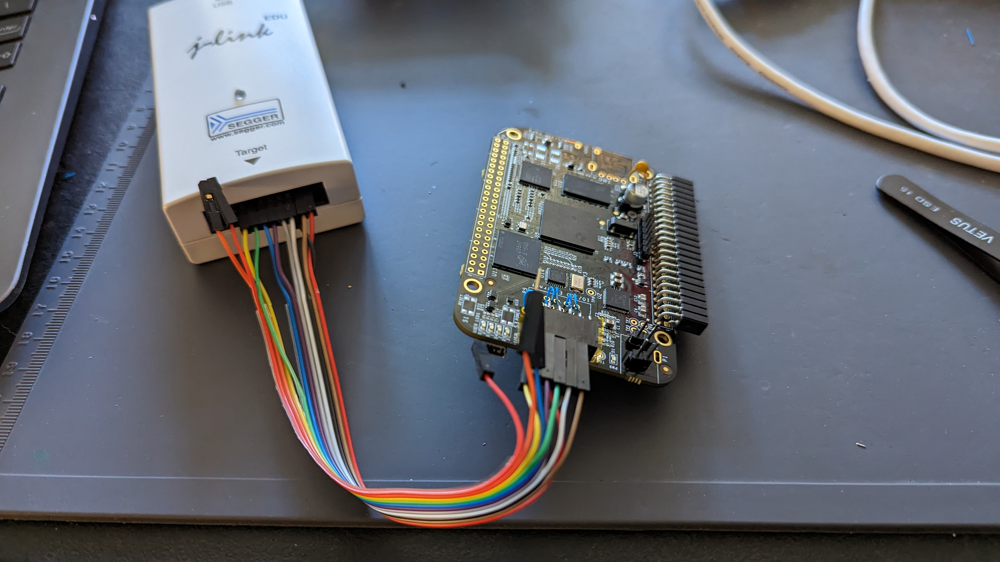

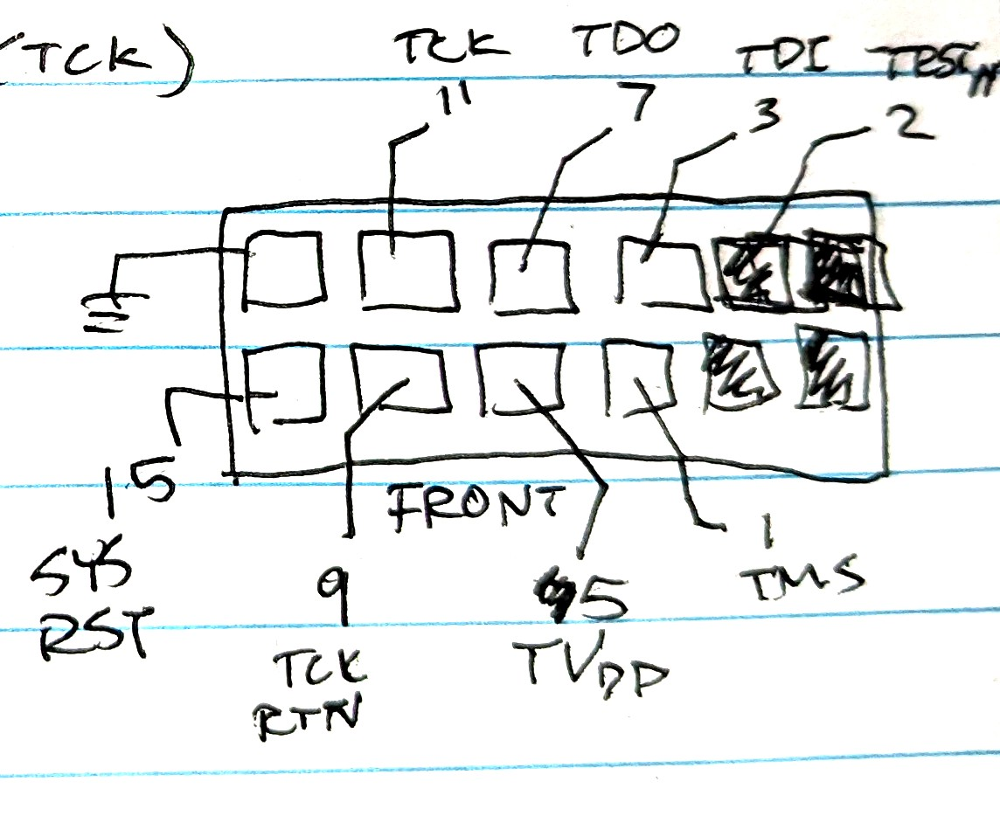

Launching into Ozone (the Segger debugger) I configured the J-Link and started by just trying to find the entry point. I had thought that a reset-halt would put me where I needed to be, which was how I came to the (incorrect) assumption that the entry point was `0x2148a`, although I certainly noticed that this wasn't consistent. Later, I realized that the AM335x boards don't really play well with the J-Link's reset-halt, so there was actually a delay of maybe a few hundred clock cycles, landing me somewhere inside a boot handler, indeterministically. (I eventually got around this by writing a GEL file for TI's Code Composer Studio which supports J-Link debugging - on reset, the PC register is set to the reset handler, the registers are cleared, and the instruction mode is forced to ARM.)

From a thread on the TI forums ([AM335x: TI employees, where can I get the ROM Bootloader source code/symbols?](https://e2e.ti.com/support/processors-group/processors/f/processors-forum/341752/am335x-ti-employees-where-can-i-get-the-rom-bootloader-source-code-symbols)) I picked up a couple debugging symbols: `SPI Initialize` at `0x231e0`, `SPI ReadSectors` at `0x23230`, and `0x24bfa` is a routine performing a UART read. That's a nice bit of help I guess. I noticed that the boot failed by ending up in an infinite loop at `0x402f0440`, a dead loop. Hmm, quite far off from the rest of the boot ROM, must be in RAM or something. It's probably time to go over to the technical reference manual (TRM)!

Chapter 26 of the TRM contains a ton of information on booting. We get the following view of the boot ROM:


**Description**:

> The architecture of the Public ROM Code is shown in Figure 26-1. It is split into three main layers with a top-down approach: high-level, drivers, and hardware abstraction layer (HAL). One layer communicates with a lower level layer through a unified interface.
> The high level layer is in charge of the main tasks of the Public ROM Code: watchdog and clocks configuration and main booting routine.
> The drivers layer implements the logical and communication protocols for any booting device in accordance with the interface specification.
> Finally the HAL implements the lowest level code for interacting with the hardware infrastructure IPs. End booting devices are attached to device IO pads.


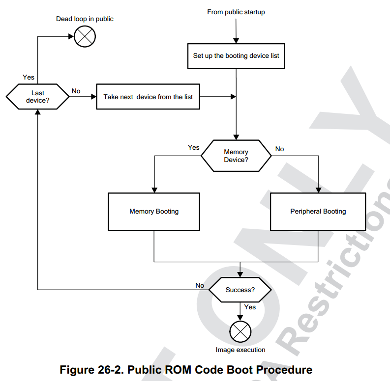

> Figure 26-2 illustrates the high level flow for the Public ROM Code booting procedure. On this device the Public ROM Code starts upon completion of the secure startup (performed by the Secure ROM Code). The ROM Code then performs platform configuration and initialization as part of the public start-up procedure. The booting device list is created based on the SYSBOOT pins. A booting device can be a memory booting device (soldered flash memory or temporarily booting device like memory card) or a peripheral interface connected to a host.
> The main loop of the booting procedure goes through the booting device list and tries to search for an image from the currently selected booting device. This loop is exited if a valid booting image is found and successfully executed or upon watchdog expiration. The image authentication procedure is performed prior to image execution on an HS Device. Failure in authentication procedure leads to branching to a “dead loop” in Secure ROM (waiting for a watchdog reset).

Memory map! Exception vectors! Flow-charts! Lots of information in this section. My job just got a *lot* easier.

At this point I used the JTAG probe to download the firmware into a couple different files, and started loading things into Ghidra. There didn't seem to be any SVD files or other register mappings available in a convenient format, which is really unfortunate, because that means I need to define the memory regions and registers and everything manually. This was a tedious process, but after a while I had a python script I could use to load symbols into Ghidra for the the AM3358. One less thing to worry about!

## Reversing

It seems like the files I have can be mapped as:

| Region                   | Start Address | Length   |
| ------------------------ | ------------- | -------- |
| Boot ROM (Public)        | `0x4002_0000` | `0xBFFF` |
| Boot ROM (Public, alias) | `0x0002_0000` | `0xBFFF` |
| SRAM Internal            | `0x402F_0400` | `0xFC00` |
| L3 OCM0                  | `0x4030_0000` | `0x10000` | 

It's interesting that the infinite loop at `0x402f_0440` is at the top of the "downloaded image" in the internal SRAM, while the exception vectors are stored elsewhere. Maybe this will be an important hint later...

On reset, the private boot ROM handles security stuff, and branches to `0x2 0000` which contains the reset vectors. The first instruction is a branch to `0x2 08d0` which must be the entry point. It's not a `BX` instruction so, presumably, we're still in Arm mode at that point. 

### Reset Handler

This is the first code run, which means it's not exactly a "function" with parameters, so much as a compiled-generated startup script. The first basic block:
```arm
	    ldr        r4,[->Peripherals::CM_PER]
	    mov        r0,#0x2c
		ldr        r6,[r4,r0]=>CM_PER.CM_PER_OCMCRAM_CLKCTRL
	    mov        r6,#0x2
	    str        r6,[r4,r0]=>CM_PER.CM_PER_OCMCRAM_CLKCTRL
	    mov        r0,#0x2c
poll:   ldr        r6,[r4,r0]=>CM_PER.CM_PER_OCMCRAM_CLKCTRL
	    cmp        r6,#0x2
	    bne        poll
```
This block sets the OCMC RAM clock to enabled:
1. Set `CM_PER_OCMCRAM_CLKCTRL=0x2`
2. Check if register was set; if not, keep polling
The `CM_PER_OCMCRAM_CLKCTRL` register uses bits 0 and 1 for the `MODULEMODE` field, setting this `=0x2` enables the clock to the OCMC RAM. 

The next basic block:
```arm
	    ldr        r0,[PTR_control_status] 
	    ldr        r0,[r0,#0x0]=>control_status 
	    and        r0,r0,#0x700
	    mov        r0,r0, lsr #0x8
	    cmp        r0,#0x3
	    bne        skip
		ldr        r0,[PTR_control_status] 
	    ldr        r0,[r0,#0x0]=>control_status
	    cpy        r6,r0
	    and        r0,r0,#0x1f
	    cmp        r0,#0x1f
	    bleq       GPMIC_init 
skip:   ...
```
This block does the following:
1. Check if `(control_status & 0x700) >> 8 == 0x3`, skip if not
2. Check if `control_status & 0x1f == 0x1f`, if so, call function `GPMC_init` after loading `control_status` into `r6`

The next block sets up the coprocessor:
```arm
		msr        cpsr_c,#0xd3
	    ldr        r4,[->Exceptions::ROM_RESET_VECTOR] 
	    mcr        p15,0x0,r4,cr12,cr0,0x0
	    bl         LAB_00020934
	    bl         LAB_00020938
	    bl         LAB_0002093c
	    bl         LAB_00020940
	    bl         LAB_00020944
	    bl         LAB_00020948
	    bl         LAB_0002094c
	    bl         LAB_00020950
	    mrc        p15,0x0,r0,cr1,cr0,0x0
	    orr        r0,r0,#0x800
	    mcr        p15,0x0,r0,cr1,cr0,0x0
	    b          LAB_000207f0
```
Operations in this block:
1. Move `11010011b` into the CPSR control field (`I=1`,`F=1`,`T=0`,`MODE=10011`)
	1. `I` is interrupt disable, `F` is fast interrupt disable (so `I=F=1` means interrupts are disabled)
	2. `T` is Thumb mode, set to `0`
	3. `MODE=10011` sets the processor mode the Supervisor mode ([ref](https://developer.arm.com/documentation/ddi0406/b/System-Level-Architecture/The-System-Level-Programmers--Model/ARM-processor-modes-and-core-registers/ARM-processor-modes?lang=en#CIHGHDGI))
	4. See [here](https://developer.arm.com/documentation/ddi0406/b/System-Level-Architecture/The-System-Level-Programmers--Model/ARM-processor-modes-and-core-registers/Program-Status-Registers--PSRs-) for more info
2. Load the address to the ROM reset vector
3. Access [coprocessor 15](https://developer.arm.com/documentation/den0013/d/ARM-Processor-Modes-and-Registers/Registers/Coprocessor-15) (system control coproc) Security Extensions register `c12` and load the ROM reset vector into the `VBAR` (vector base address register)
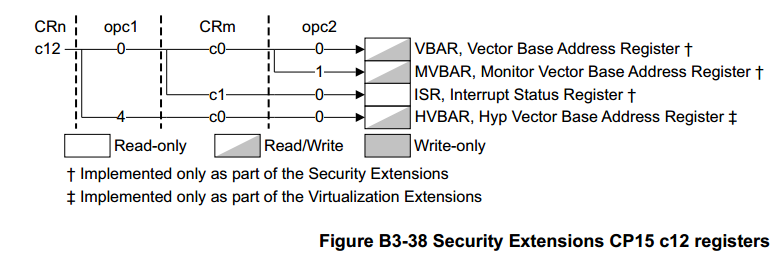
4. Look like `nop` jumps? Why `bl` instead of `b`?
5. Enable branch prediction (set system control register `SCTLR` bit 11)

*CP15 `c1` registers (system control registers) in VMSA implementation*

Description of the `SCTLR` register:
> The SCTLR provides the top level control of the system, including its memory system.
> This register is part of the Virtual memory control registers functional group. 

See TRM page B4-1687. Bit 11 is the *branch prediction enable* bit, setting it enabled means [branch prediction](https://developer.arm.com/documentation/ddi0406/b/System-Level-Architecture/Common-Memory-System-Architecture-Features/Caches/Branch-predictors) is enabled. 

6. Call a function (through a branch to a call instruction)

### Function at `0x20894` (`__main`)

This function is branched to by another early routine. I think it initializes the stack, and possibly timers or the watchdog, before calling `FUN_0002889c` (later revealed to be `main()`!). 

```arm
		 ldr    sp,[->RESERVED_EXCEPTION_BRANCH]   ; 0x4030ce00
		 blx    load_stack_1
		 ldr    r12,[DWORD_1]
		 add    r12,r12,pc
		 tst    r12,#0x1
		 adrne  lr,0x208bd
		 cpyeq  lr,pc
		 bx     r12 ;=>init_timers_maybe
		 adr    r12,0x208bd
		 bx     r12 ;=>LAB_000208bc
000208bc bl     FUN_0002889c
000208c0 ddw    0x109
000208c4 addr   RESERVED_EXCEPTION_BRANCH
...
RESERVED_EXCEPTION_BRANCH:
         ldr    pc=>LAB_00020090,[PTR_LAB_4030ce20]
         ; 20090 is a dead loop
```

The operations here are:
1. Load the start of the RAM exception table into the stack pointer
2. Branch to a function that pushes `r0,r1,r2,r3,r4,lr` onto the stack (public stack in memory map)
	1. That function `load_stack_1` branches to an empty function `bx lr`, then pops `r0,r1,r2,r3,r4,pc` from the stack (basically puts that data back into the registers and puts whatever `lr` holds into the `pc` to return)
3. Check if `pc + 0x109` is odd, if even load `0x208bd` into `lr`, otherwise copy `pc` into `lr`
4. Call main function
5. Call `FUN_0002889c`

This should be the `__main()` function referred to in the boot flow chart:

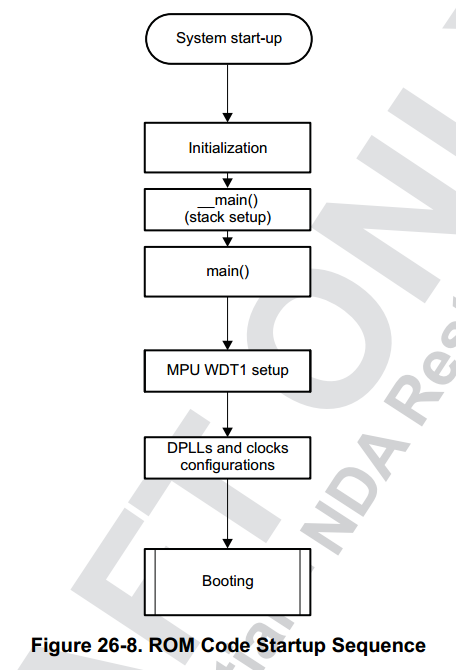

This would make the next function the `main` function. 

> As shown at top of Figure 26-8, the CPU jumps to the Public ROM Code reset vector once it has completed the secure boot initialization. Once in public mode, upon system startup, the CPU performs the public-side initialization and stack setup (compiler auto generated C- initialization or “scatter loading”). Then it configures the watchdog timer 1 (set to three minutes), performs system clocks configuration. Finally it jumps to the booting routine.

### Main Function (`0x209b0`)

When main is called, the `SP` register points to `0x4030ce00`. This is where the stack starts, and it grows down towards `0x4030 b800`; and since we're pointing to the address `0x4030 cdf0` after pushing 4 registers (a difference of 16 bytes or 4 words), we're using a **full descending stack**, as in AAPCS. That is, `SP` points to the most recent word on the stack and grows down. 

Here's the decompiled `main()` function:

```c
int main()
{
  uint local_10;
  uint local_c;
  
  local_c = 0;
  local_10 = 0;
  check_stack_prm(&local_10);
  update_coldreset_tracing_vector(local_10);
  update_current_tracing_vector(1);
  main_clock_init(6,0);
  watchdog_softreset();
  watchdog_write_disable_seq_data2();
  set_watchdog(300000);
  if ((local_10 & 1) != 0) {
    update_current_tracing_vector(2);
    local_c = local_c & 0xffff | 1;
  }
  timer_func_1();
  clock_init_func_4(&local_c);
  run_booting_loop(&local_c,local_10 & 0xff);
  return 0;
}
```
Most interesting for my purposes is the `run_booting_loop` function at `0x20a10`. 

### X-Loader Notes

After going through the startup and getting to this part with strings like "ISSW" and "CHSETTINGS" and "X-LOADER", I started looking around for other places these strings might pop up in U-Boot related contexts. I stumbled on [this thread](https://forum.xda-developers.com/t/discussion-on-the-boot-loader-cracked.1378886/) of people reversing or cracking the Nook firmware, and the [x-loader source](https://github.com/joelagnel/x-loader/blob/f3c74bc9b01dac58e553393d6ec1041353f2f1f7/scripts/signGP.c) contains references to things like `CHSETTINGS`. From looking around, "ISSW" [seems to](https://github.com/u-boot/u-boot/blob/master/doc/README.ti-secure) refer to booting from non-memory devices. 

Recall from the initialization documentation, the high level code:
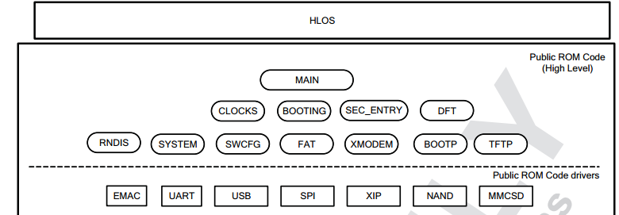

Of interest:
- RNDIS
- FAR
- XMODEM
- BOOTP
- TFTP
- DFT

Maybe it's time to try some live debugging again. Trying to reverse all those structs would probably be painful considering the large amount of data which I can't understand...

Hooray! Live debugging works when setting the PC and SP manually using the vectors I've found:


From the source and the tracing vectors, I was able to map out the various boot options and what device number they are assigned. This later became very useful, since I had to distinguish between MMC0 (8) and MMCSD1 (9) when setting breakpoints in the SD/MMC boot handler. 

| Type       | Device            | Device ID   |
| ---------- | ----------------- | ----------- |
| Memory     | XIP (MUX2)        | 1           |
| Memory     | XIP w/WAIT (MUX2) | 2           |
| Memory     | XIP (MUX1)        | 3           |
| Memory     | XIP w/WAIT (MUX1) | 4           |
| Memory     | NAND              | 5           |
| Memory     | MMCSD1            | 7, 9 (eMMC) |
| Memory     | NAND_I2C          | 10          |
| Memory     | MMC0              | 8, 12 (SD)  |
| Peripheral | UART0             | 16          |
| Peripheral | USB               | 20          |
| Peripheral | GPGMAC0           | 22          |

For information about how the processor boots, see the TRM and [this answer on stack exchange](https://stackoverflow.com/a/31252989/8565545). To summarize: 
1. The boot ROM has identified the MLO (Mmc LOader) file on the SD card and copied it to SRAM
2. This is the secondary program loader, a smaller bootloader which initializes the full RAM and copies the full U-Boot binary there for execution
3. After the U-Boot binary runs, we (or rather U-Boot) finally boot the kernel

### `run_booting_loop()`

This is the main boot loop. It runs infinitely, or until execution branches to another bootloader which would be loaded into RAM. 

Start of the procedure, without tracing vector updates:
- Lookup device type
	- If device type is 5 (secure device) do some other initialization
- Run `build_boot_list(int,buffer[],data[],int)`  
	- `buffer[]` is initialized to `0xff` and `data[]` includes the device type (probably)


```c
void run_booting_loop(uint32_t *r0_config,undefined4 param_2,undefined4 param_3,
                     undefined4 default_list)

{
  int iVar1;
  uint j;
  uint i;
  int device_type;
  byte alt_list [12];
  undefined4 boot_status;
  byte boot_list [8];
  uint8_t local_buffer [8];
  
  update_current_tracing_vector(3);
                    /* Device type is 3 */
  lookup_device_type(&device_type);
  if ((device_type == AM335X_HIGH_SECURITY) && (iVar1 = return_zero_4(), iVar1 != 0)) {
    init_something_1_small(&STATIC_DATA_1);
  }
                    /* param1 = 1
                       param2 = 4030 ebc4
                       param3 = 4030 ebb4 */
  build_boot_list(*(ushort *)r0_config,boot_list,alt_list,default_list);
  do {
    i = 0;
    local_buffer[0] = 0xff;
    local_buffer[1] = 0xff;
    local_buffer[2] = 0xff;
    local_buffer[3] = 0xff;
    do {
      if (boot_list[i] - 1 < 12) {
        update_current_tracing_vector(4);
                    /* No return unless there is an error */
        boot_device_1(r0_config,boot_list[i],local_buffer);
      }
      else if (boot_list[i] - 65 < 8) {
        update_current_tracing_vector(5);
        watchdog_write_disable_seq_data2();
        boot_status = 0xffffffff;
        boot_device_2((uint32_t)r0_config,boot_list[i],&boot_status,local_buffer);
        watchdog_write_enable_seq_data2();
        if (boot_status != 0xffffffff) {
          local_buffer[0] = (undefined)boot_status;
          local_buffer[1] = boot_status._1_1_;
          local_buffer[2] = boot_status._2_1_;
          local_buffer[3] = boot_status._3_1_;
          if ((boot_status & 0xffff00ff) == 0xf0030006) {
            update_current_tracing_vector(9);
            boot_list[i + 1] = (byte)(boot_status >> 8);
          }
          else if (boot_status != 0xf0030002) {
            update_current_tracing_vector(8);
            j = 0;
            do {
              if (63 < boot_list[j]) {
                boot_list[j] = 0;
              }
              j = j + 1 & 0xff;
            } while (j < 8);
          }
        }
      }
      i = i + 1 & 0xff;
    } while (i < 8);
    update_current_tracing_vector(6);
  } while( true );
}
```


### Booting into SRAM

I found that there was a function at `0x23d7a` which I've called `boot_into_SRAM()` which was the last function called before branching into SRAM, and then from there, going into the exception handler. Previously, I had a different state of RAM saved, but while live debugging one more time (now over a year later, July 2024), I realized what must be going on. The board was successfully reading data from the SD card, and was running code which it had loaded from the card! To verify this, I had to find bytes in the SRAM which were the same as what was on the SD card. It turns out, within `am335x-evm-linux-sdk-bin-.../board-support/prebuilt-images/` there is a binary file called `u-boot-spl.bin-am335x-evm`, and the code in this binary matches what appears in SRAM. We've reached the uboot SPL!

### UART Terminal

We've successfully booted into the SRAM, now I'm wondering about the UART terminal, which should show information about uboot. The hardware connection is below.

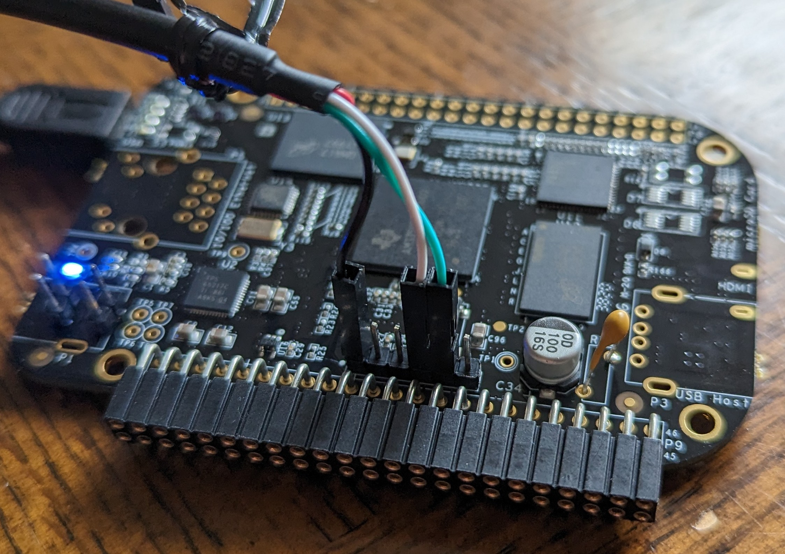

Connecting to the device with CuteCom, 115200 @ 8-N-1, without an SD card inserted it simply outputs `C` repeatedly. 

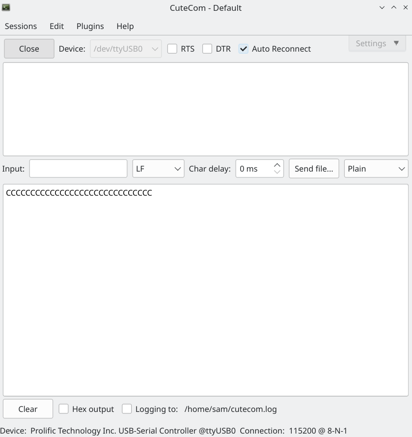

But when the SD card is inserted, the UART doesn't output anything. No messages, no characters. The fault must be coming up too early in the boot process? But now that I also know what code it's executing (and I have its source) I should be able to build some debugging symbols for it and get a proper debug session going. This might not be trivial, I have to make sure I'm compiling the code the same way, it might just take me some time to learn exactly what the SDK has loaded onto my SD card and how to build it.

Since U-Boot would be outputting text to the UART, and I'm not seeing anything, I'm guessing we're catching an exception somewhere in the SPL. 

At this point, I spent many, many hours reversing and cleaning up the boot ROM decompiled source in Ghidra, looking at structs and how each data member was used across functions, sometimes being nested, creating all sorts of havoc for me. While that was on the back burner, I figured it was also time to start debugging and compiling my own code. We are in RAM after all, why not load the SPL symbols and see what's going on?

### SDK Development

#### Debugging

You can debug with Ozone, the Segger debugger for J-Link. You can also use TI's own Code Composer Studio (CCS) or maybe also its VSCode-style "light" version CCS Theia. I was able to build everything in the SDK by following this video: [Sitara Linux Board Porting Series: Module 6](https://www.youtube.com/watch?v=GECfznfFnwI&ab_channel=TexasInstruments). There are three components to build:
- Processor configuration
- U-Boot binary
- U-Boot Secondary Program Loader (SPL)

I followed the [Module 7 video](https://www.youtube.com/watch?v=qV02_ztqCVk&ab_channel=TexasInstruments) from the above series and managed to get things working, with a couple notes:
1. `s_init()` is not present anymore
2. Hardware breakpoints with the J-Link need to be set through the J-Link control panel (see tray icon). Not sure how to load code with this. Maybe through Ozone.

Having symbols? Beautiful. Now I can see what is happening in execution, starting with a reset handler `reset()`, and I can see where we end up with our exception. To track it down, I set a breakpoint at the exception handler at `0x402f 0440`, and checked the link register, which still stored the address of the most recent function. This turned out to be address `0x402f 76ce`, although it doesn't seem consistent. What's causing the error? 

Note: For debugging, following the Module 7 video, run until `0x402f 0400`, *then* do the Load Memory() bit. This must be done every restart. 

We go into the function `device_probe()` (`0x402f 74c4`), then a couple other functions? Then from `do_setup_dpll()` branched at `0x402f 07fc`, we don't exit, so let's keep going into that. Stepping along, we get back to `_main()` in `crt0.S`, located at `0x402f 14e0`. It seems like we might be coming out of `board_init_f()`, proceeding to `spl_relocate_stack_gd()`. This call does not exit. We reach `dm_fixup_for_gd_move()`. This contains an instruction that fails, at `0x402f 76c2`. I think this is it: it's trying to access `0x81ff ff20`. No good apparently. I have a hunch that there's a problem with the SDRAM configuration. I tracked down all the threads on the TI forums relating to similar issues, and found half a dozen that contained some hints to help me out. I concluded that it was probably related to either (a) EMIF tuning, or (b) software leveling.

### DDR3 RAM Configuration

My board is the one shown below.

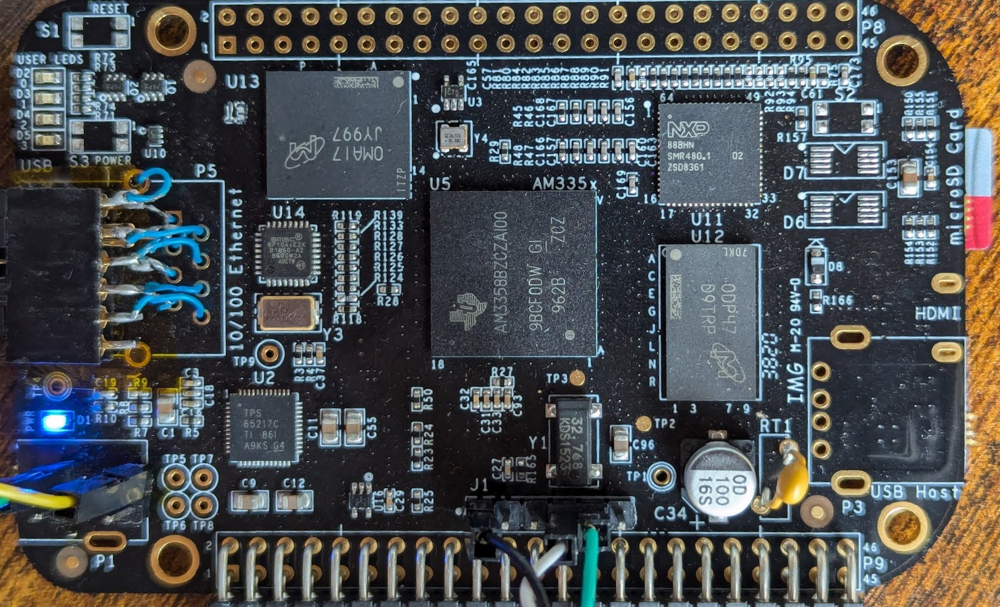

The memory is from Micron, while the schematic for the BeagleBone Black that I have (rev C3) uses Kingston DDR3 memory, specifically the D2516EC4BXGGB. The DDR3 is U12, we can use the [Micron marking decoder page](https://www.micron.com/sales-support/design-tools/fbga-parts-decoder) to find the part:
- [MT41K256M16TW-107 XIT:P](https://www.micron.com/products/memory/dram-components/ddr3-sdram/part-catalog/part-detail/mt41k256m16tw-107-xit-p)
	- 256 Meg x 16
	- 96-ball 8mm x 14mm FBGA, rev P
	- $t_{CK}$=1.07ns, CL = 13

Let's make the sure the thing is alive, I started by simply checking that the power was supplied. The datasheet specifies that it must be 1.5V +/- 0.075V. I measure 1.506V across R6 on the underside of the board. We have two test points, TP1 and TP2.

In case it's ever helpful, here are a couple of the test points.

| Test Point | Connection              | Schematic Sheet | Side of Board |
| ---------- | ----------------------- | --------------- | ------------- |
| TP1        | DGND                    | 2 (D1)          | Top           |
| TP2        | VDD_MPUON (VDD_MPU_MON) | 5 (C4)          | Top           |
| TP3        | TESTOUT                 | 5 (B2)          | Top           |
| TP4        | Board ID WP             | 11 (B1)         | Top           |
The memory circuitry is described in detail on the hardware design page.
- [Memory Device](https://docs.beagleboard.org/latest/boards/beaglebone/black/ch06.html#memory-device)

Let's check the clock enable line. We can check both sides of R96, one side should be grounded, the other side should be held high.
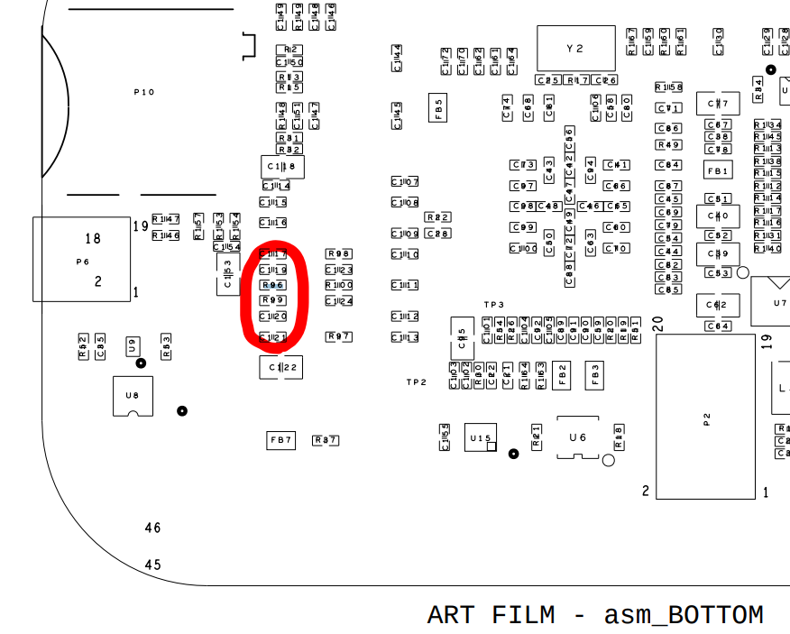
Confirmed, 1.5V on CKE. 

The next step is to check the clock signal. I did what I could here, using the tinySA with the antenna connected pointing roughly in the direction of the RAM chip. Doing this sort of "sniffing" I feel fairly sure that the clock is present, at least enough for right now. 

Moving on, it's time to look at external memory interfacing. Something that comes up a lot is the concept of a [GEL file](https://software-dl.ti.com/ccs/esd/documents/users_guide/ccs_debug-gel.html). This is an interpreted language developed by Texas Instruments for Code Composer Studio, it stands for **General Extension Language**.
- [Creating Device Initialization GEL Files](https://www.ti.com/lit/an/spraa74a/spraa74a.pdf)

A GEL file is included in the [DDR memory config tool](https://www.ti.com/tool/download/SITARA-DDR-CONFIG-TOOL-AM335X). 

Alright! I followed the tuning procedure (as best I could) and managed to find optimal values for the GEL file. 
```
***************************************************************
	The Slave Ratio Search Program Values are... 
***************************************************************
PARAMETER                       MAX  |  MIN  | OPTIMUM |  RANGE	
***************************************************************
DATA_PHY_RD_DQS_SLAVE_RATIO    0x071 | 0x005 |  0x03b  | 0x06c
DATA_PHY_FIFO_WE_SLAVE_RATIO   0x1b3 | 0x046 |  0x0fc  | 0x16d
DATA_PHY_WR_DQS_SLAVE_RATIO    0x0f7 | 0x01a |  0x088  | 0x0dd
DATA_PHY_WR_DATA_SLAVE_RATIO   0x137 | 0x05a |  0x0c8  | 0x0dd
***************************************************************
```

Trying to adjust RAM things in the Memory Browser... Woo! It works! 

So the memory certainly seems to be working, but the SPL is still failing, so there's maybe something going on here regarding the way the SPL is trying to initialize the SDRAM? Ah, right, there's more to the tuning procedure, of course! You have to actually update the SPL...

We're getting closer now. The file `board.c` initializes DDR by checking what type of board we have. But for this board, all of the functions (`board_is_evm_sk()`, `board_is_icev2()`, `board_is_bone_lt()`, etc) return false, so it defaults to `config_ddr(266, ...)` where the 266 is the clock frequency in MHz, and it *should* be 400 MHz. That would certainly be an issue. 

`board_is_bone_lt` should be bypassed to always return true. I did this, and I get a little bit further, but something is bugging me. Loading the new file MLO onto the SD card does not work, even though loading the program directly works fine. What's going on here? I can tell that the code being loaded into SRAM is not the same code that I have compiled. In fact, I even formatted the SD card, and a default SPL seems to be loading into sram anyway! I verified that the boot process does not try to continue when using another SD card. Therefore, the bootloader is definitely looking for the boot partition on the SD card, then it moves execution to the SRAM, but it has not yet copied the data over? Ugh. Where is it coming from??

This problem caused me no small amount of trouble. I deleted all the partitions, zero'd out the MBR, zero'd out the boot partition, and tried different SD cards, and only my card was still able to boot, so there had to be *some* bootable data still on it, stored somewhere. Finally, I was able to put an end to the madness by zeroing out the *entire* card. 

I also learned at this point about the **tracing vectors** that you can access when troubleshooting the boot ROM. This would also come to be extremely helpful for reversing, since I knew where all the tracing calls were coming from, and could then assign function names etc based on those calls. I made a spreadsheet to interpret these tracing vectors, and used this for quickly understanding how the boot procedure changed as I changed the card parameters. Sure enough, it was claiming to find the CHSETTINGS over and over as I tried formatting and reformatting the SD card, before I desperately zero'd out the whole thing. 

To try and read the card the way the TI processor would, you can use `dd`. Use block size=512, and specify the first sector (try using GParted to check which) by skipping the first `n`. Example: First sector is 2048, device is `sda`, we'll read only the first sector:
```
sudo dd if=/dev/sda1 of=/home/sam/sector2048 bs=512 skip=2048 count=1
```

I used this to download images of the MBR and the start of the boot partition directly from the SD card, both of which would come in handy later.

### Digging Into the SD Card

My reversing efforts in Ghidra had led me to the SD card boot handler functions, and I could now see functions sending SD commands over to the card, and I could step through and see what the card was responding with. I *thought* I was looking in the right place, and that the card was returning all zeros. I later learned that I was possibly stepping through the eMMC handler (the same handler but with a different device ID), or something else was wrong, because there wasn't anything wrong with the SD card. Nonetheless, I figured it was time to learn about how these cards work. 

I was curious to see why the card kept returning all zeroes during each block request. Clearly, the card functions and the software can read from it because it's already done it in the past. But still, it was time to wire things up and take a look with logic analyzer. A bit of microsoldering, holding down the 30awg wires with UV-cure epoxy, and clipping on with my Saleae, and we have something that works. 

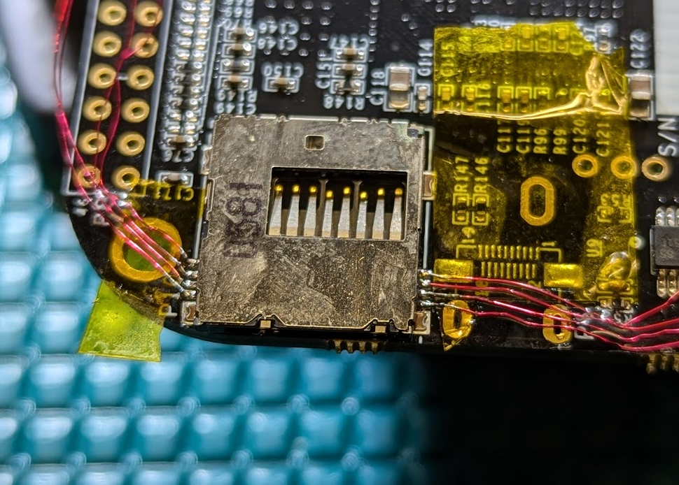
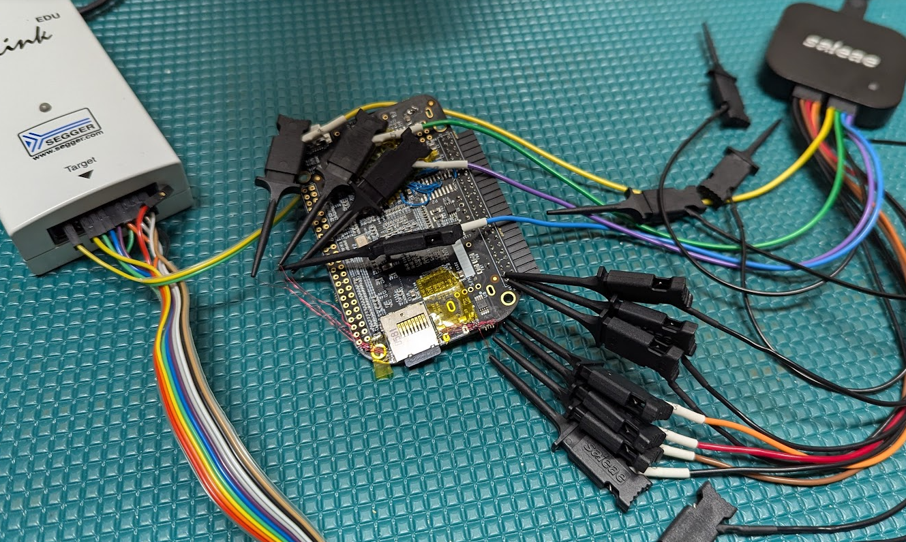

I used [this analyzer](https://github.com/airbus-seclab/sdmmc-analyzer) to analyze the data. First I tried it without a card inserted.

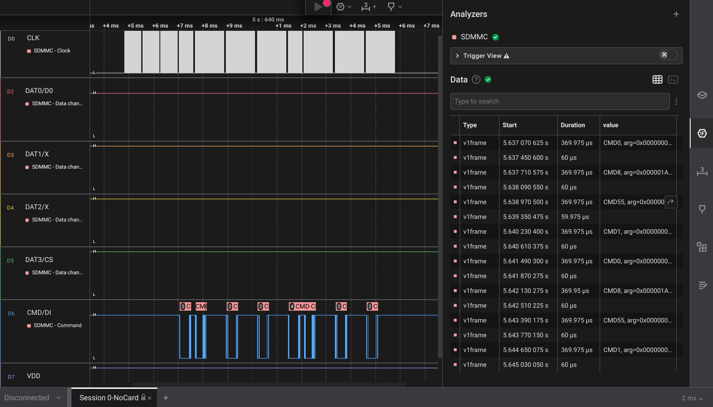

For the first few commands the clock rate is 120 kHz. Obviously, the card does not reply (it's not there).

```
CMD0, arg=\0 GO_IDLE_STATE
CMD8, arg=\x01\xAA SEND_EXT_CSD
CMD55, arg=\0 APP_CMD
CMD1, arg=\0 SEND_OP_COND
...
CMD0, arg=\0 GO_IDLE_STATE
CMD8, arg=\x01\xAA SEND_EXT_CSD
CMD55, arg=\0 APP_CMD
CMD1, arg=\0 SEND_OP_COND
```

When the card is actually inserted, the frequency jumps to around 6 MHz after configuration.

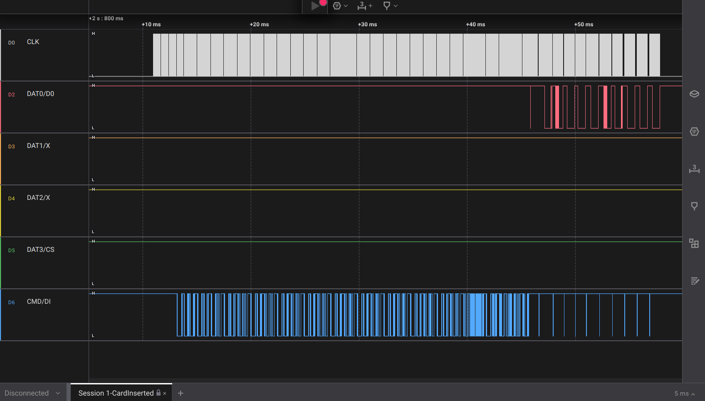

After getting over some crashes from using the SD mode (tip: even for this SD card you should use the MMC mode) and I could verify that the card was providing reasonable data. I put this to rest after this because I redoubled my efforts to understand the SD card boot handler and realized that the correct data *was* being read, and it was the same data as I had gotten from manually `dd`ing the card! Welp, it was a fun detour and helped me feel confident that the card was working. 

### Finding the Problem

The data comes from address `0x4030c928` (a stack variable, 512 byte array) after running the branch at `0x25c2e` for address `0x0000` and device `8` (see static data at `0x4030d00c`). Jumping into the method I've called `MBR_detection` the program checks for the magic bytes `0xaa55`. First it loads the second two bytes `0xaa`, then the first `0xaa`. 
```
r0 = data[0x1ff]
r1 = data[0x1fe]
orr r0,r1,r0,lsl #8
sub r1,r0,#0xaa00
subs r1,#0x55
bne <return FAIL>
```
This succeeds. The next check fails, however:
```
r0 = data[0xc]           => 0
r1 = data[0xb]           => 0
orr  r0,r1,r0, lsl #8
cmp  r0,#0x200
bne <return FAIL>
```
Decompiler pseudocode:
```c
if (
	 data[0x1fe] != 0x55aa || 
	 data[0xb]   != 0x200  ||
	(data[0xd] != 1 &&     // bit 0
	 data[0xd] != 2 &&     // bit 1
	 data[0xd] != 4 &&     // bit 2
	 data[0xd] != 8 &&     // bit 3
	 data[0xd] != 0x10 &&  // bit 4
	 data[0xd] != 0x20 &&  // bit 5
	 data[0xd] != 0x40 &&  // bit 6
	 data[0xd] != 0x80)    // bit 7
	) 
{
	return 1;
}
```
This checks if the byte at `0xb` = 11 is equal to `0x200`, and checks whether the byte at `0xd` is equal to a single-bit value. Both conditions must be met, or it returns a failure. 

After the detection function returns a `1`, the boot handler next tries to read it as an MBR and loads up the offset of the first partition to try and see if *that* is a bootable partition. Here's the procedure:

```C
	// Call block read function
	// mmc_block_read_something(boot_device *dev,blk_read_struct *blk)
  ret = (*(code *)blockread_struct->block_read_func)(blockread_struct->device_ptr,&block_read_info);
  if (ret != 0) {
    return 1;
  }
	// Check if device doesn't use MBR
  ret = MBR_check_bootable_partition((partition_struct *)block_data,blockread_struct);
  if (ret != 0) {
	// It uses MBR, try each partition in the partition entries for a bootable
	// partition
    ret = MBR_check_entries(block_data,blockread_struct);
    if (ret != 0) {
      return 1;
    }
    ret = MBR_parse_entries(block_data,&blockread_struct->part_entry);
    if (ret != 0) {
      return 1;
    }
	// Get bootable partition offset
    block_read_info = (blk_read_struct *)(blockread_struct->part_entry).first_sect_pos;
    uStack_220 = 1;
    pbStack_21c = block_data;
	// Call block read function
	// mmc_block_read_something(boot_device *dev,blk_read_struct *blk)
    ret = (*(code *)blockread_struct->block_read_func)
                    (blockread_struct->device_ptr,&block_read_info);
    if (ret != 0) {
      return 1;
    }
	// Try and verify bootable partition again
    ret = MBR_check_bootable_partition((partition_struct *)block_data,blockread_struct);
    if (ret != 0) {
      return 1;
    }
  }
```

So now I jump to the point where it reads the data at `0x800` and I get the correct dump. But the MBR detection method still returns 1, even with the right data (and there's a few layers of indirection there that I had to follow, grrr) so that must be where the problem lies. 

Home stretch now. The first memory read from the SD card is the MBR, which has up to four partition table entries, see TRM Tables 26-20, 26-21. The partition table entry for the boot partition says that the partition contains `0x40000` sectors. But the partition file system (see TRM Table 26-23) says that there are only `0x3fff8`, for some reason, and the boot ROM detects this and fails.

As an experiment, I hopped the jump that was causing problems (which might turn out badly... fingers crossed...) and the program certainly continued, although I'm not sure where I ended up, seems like garbage. But ignoring that, the device actually boots! Setting a breakpoint at `0x402f0400` (start of loaded image) and everything is going properly. Maybe time to hook up the UART? UART is good!

As for the SD card issue? I asked a [question on Unix SE](https://unix.stackexchange.com/questions/781715/why-do-the-mbr-partition-entry-and-partition-filesystem-disagree-on-the-number-o/781755), but didn't get much help in the issue at hand (though I got some good info anyway). From there: I finally fixed it! Reviewing the `mkfs` commands for building the FAT16 filesystem, I noticed that [another reference](https://blog.billvanleeuwen.ca/porting-u-boot-onto-the-beaglebone) uses the -a flag, which disables alignment. This was the key. Adding that flag and rebuilding, the sector counts agree (`0x40000`) and the system boots. I guess the boot ROM doesn't support that sort of alignment.

I get the messages below in a boot loop now, with the card plugged in. Hooray! Just need to figure out why the kernel isn't starting, and then we're golden! All that work might finally pay off with a few usable beaglebone boards. Worth it? Who's to judge. 

```
U-Boot SPL 2021.01-00001-gc59bf25a382-dirty (Jul 24 2024 - 20:38:49 -0400)
Trying to boot from MMC1


U-Boot 2021.01-00001-gc59bf25a382-dirty (Jul 28 2024 - 20:36:46 -0400)

CPU  : AM335X-GP rev 2.1
Model: TI AM335x BeagleBone Black
DRAM:  512 MiB
WDT:   Started with servicing (60s timeout)
NAND:  0 MiB
MMC:   OMAP SD/MMC: 0, OMAP SD/MMC: 1
Loading Environment from FAT... *** Warning - bad CRC, using default environment

<ethaddr> not set. Validating first E-fuse MAC
Net:   eth2: ethernet@4a100000, eth3: usb_ether
Hit any key to stop autoboot:  2 <0x08><0x08><0x08> 1 <0x08><0x08><0x08> 0 
WARNING: Could not determine device tree to use
switch to partitions #0, OK
mmc0 is current device
SD/MMC found on device 0
Failed to load 'boot.scr'
Failed to load 'uEnv.txt'
switch to partitions #0, OK
mmc0 is current device
Scanning mmc 0:1...
libfdt fdt_check_header(): FDT_ERR_BADMAGIC
<0x1b>7<0x1b>[r<0x1b>[999;999H<0x1b>[6n<0x1b>8Scanning disk mmc@48060000.blk...
Scanning disk mmc@481d8000.blk...
** Unrecognized filesystem type **
Found 4 disks
No EFI system partition
BootOrder not defined
EFI boot manager: Cannot load any image
switch to partitions #0, OK
mmc0 is current device
SD/MMC found on device 0
4997632 bytes read in 353 ms (13.5 MiB/s)
Failed to load '/boot/undefined'

Starting kernel ...
```

So there's an issue with the device tree ("`WARNING: Could not determine device tree to use`"). This is my first encounter with the kernel and kernel booting, so I have no idea what that means. 

"Booting the kernel" involves the following, as I understand it:
1. U-Boot loads and looks for a kernel image (zImage); the *kernel image* is a compressed kernel binary, zImage is self-decompressing
2. The kernel image is loaded into memory, then decompressed, either by itself (zImage) or by U-Boot (uImage)
3. The kernel executes its usual low level stuff, then runs the init programs/daemons

An important aspect of the kernel boot process is the device tree. This is stored in the `.dtb` file (device tree binary; compare with `.dts` device tree source files) for the board. 

My problem now is that U-Boot isn't loading the board's device tree, since there's no message `reading /am335x-boneblack.dtb` in the log. Instead, we get `WARNING: Could not determine device tree to use`. So that's good evidence! Guessing it's due to the missing EEPROM board id. 

Some details about how it gets the board are found in [this thread](https://e2e.ti.com/support/processors-group/processors/f/processors-forum/852398/am3358-u-boot-device-tree-issue) on the TI forums.

So, how does U-Boot know how to configure itself and boot properly? Within the U-Boot source that we built, there's a folder called `configs/` which stores `defconfig` files for various different boards. These files define the various configuration parameters for U-Boot, including the boot command, which might look like this:
```
if test ${boot_fit} -eq 1; 
then run update_to_fit; 
fi; 
run findfdt; 
run init_console; 
run envboot; 
run finduuid; 
run distro_bootcmd
```

We define which config to use when we run the `make <boardname>_config` target. The function `findfdt` is used to identify the board that we're running, and configures the device tree properly. It looks like this (defined in `am335x_evm.h`):
```
"findfdt="\
		"if test $board_name = A335BONE; then " \
			"setenv fdtfile am335x-bone.dtb; fi; " \
		"if test $board_name = A335BNLT; then " \
			"setenv fdtfile am335x-boneblack.dtb; fi; " \
		"if test $board_name = A335PBGL; then " \
			"setenv fdtfile am335x-pocketbeagle.dtb; fi; " \
		"if test $board_name = BBBW; then " \
			"setenv fdtfile am335x-boneblack-wireless.dtb; fi; " \
		"if test $board_name = BBG1; then " \
			"setenv fdtfile am335x-bonegreen.dtb; fi; " \
		"if test $board_name = BBGW; then " \
			"setenv fdtfile am335x-bonegreen-wireless.dtb; fi; " \
		"if test $board_name = BBBL; then " \
			"setenv fdtfile am335x-boneblue.dtb; fi; " \
		"if test $board_name = BBEN; then " \
			"setenv fdtfile am335x-sancloud-bbe.dtb; fi; " \
		"if test $board_name = A33515BB; then " \
			"setenv fdtfile am335x-evm.dtb; fi; " \
		"if test $board_name = A335X_SK; then " \
			"setenv fdtfile am335x-evmsk.dtb; fi; " \
		"if test $board_name = A335_ICE && test $ice_mii = rmii; then " \
			"setenv fdtfile am335x-icev2.dtb; fi; " \
		"if test $board_name = A335_ICE && test $ice_mii = mii; then " \
			"setenv fdtfile am335x-icev2-prueth.dtb; fi; " \
		"if test $fdtfile = undefined; then " \
			"echo WARNING: Could not determine device tree to use; fi; \0" \
```
If we want default behavior, we can simply change the `board_name` variable, right? Well maybe not, or at least I don't know where the best place to change it is. But while setting `board_name` didn't work per se, but I actually also updated the default `.dtb` file and that worked!

```
_____                    _____           _         _      
|  _  |___ ___ ___ ___   |  _  |___ ___  |_|___ ___| |_    
|     |  _| .'| . | . |  |   __|  _| . | | | -_|  _|  _|  
|__|__|_| |__,|_  |___|  |__|  |_| |___|_| |___|___|_|     
             |___|                    |___|               
  
Arago Project http://arago-project.org am335x-evm ttyS0  
  
Arago 2021.09 am335x-evm ttyS0  
  
am335x-evm login: root  
root@am335x-evm:~#
```

At long last, we're at a terminal. My junk boards are alive!

### Fixing the Missing EEPROM ID

As a last step, I'll write in the correct board ID to the EEPROM, which is easy to do from within Linux user space. From the SPL source, the various board IDs are:
- `A335BONE` - Beaglebone board
- `A335BNLT` - Beaglebone Black board
- `A335PBGL`
- `A335X_SK`
- `A33515BB`
- `A335_ICE`

And there's also an optional board revision. Based on the schematic, the EEPROM is on I2C0, and the chip itself (24LC32A on my schematic, although it's labeled '256Kx8) provides the I2C device address of `0x50` (binary `b1010` followed by `000` chip address, since the 5 pin package doesn't have additional address pins). One last point of note: the WP pin is pulled HIGH with a 10k pull-up, so write protect is enabled by default; it needs to be tied low before any writing can occur, or else it will acknowledge but simply not write anything. 

The EEPROM can be accessed through the kernel at `/sys/bus/i2c/devices/0-0050`, within which there is a file called `eeprom`. Therefore, with the WP pin pulled LOW (tie TP4 on the top near the DC jack to ground) a few `echo` calls is all that's needed. The Beaglebone Black System Reference Manual has the format.
```sh
root@am335x-evm:~# cat fix_eeprom.sh 
#!/bin/bash
# Fix board ID EEPROM

EEPROM_FILE=/tmp/eeprom.tmp
EEPROM=/sys/bus/i2c/devices/0-0050/eeprom

# header bytes
echo -ne "\xaa\x55\x33\xee" > ${EEPROM_FILE}
# Board ID
echo -n "A335BNLT" >> ${EEPROM_FILE}
# serial number (I left this basically as the template)
echo -n "000C24wwBBoxxxx" >> ${EEPROM_FILE}

dd if=${EEPROM_FILE} of=${EEPROM}
```
Using `less` to confirm, and we should have no issue running a default SD card from now on. Changes to the SPL and the U-Boot config can be rolled back, once all boards have their EEPROMs written. 
